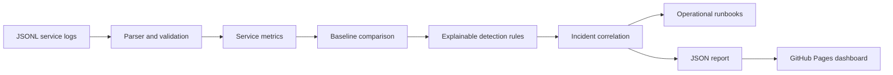

# SignalOps — Explainable AIOps Log Intelligence

SignalOps is a compact, interview-ready AIOps project that turns structured service logs into operational signals, correlated incidents, and deterministic investigation runbooks.

The project intentionally uses transparent statistical baselines and rules instead of presenting a black-box model as artificial intelligence. Every alert can be traced to measured evidence, a documented threshold, and a testable response path.

## What it demonstrates

- Python data processing and structured-log parsing
- Baseline comparison and rule-based anomaly detection
- Error-rate, latency, event-volume, and repeated-pattern signals
- Incident correlation and severity prioritization
- Automated operational runbooks
- Unit and integration testing with pytest
- CI/CD checks and GitHub Pages deployment
- A responsive operational dashboard generated from real pipeline output

## Example result

The deterministic sample contains three services and 900 current-window events. SignalOps identifies a checkout-service incident by correlating:

- an error-rate increase to 15%;
- P95 latency above 2.1 seconds; and
- 27 repeated `UPSTREAM_TIMEOUT` events.

The report then attaches a short investigation runbook covering log grouping, trace review, recent-change comparison, and upstream dependency checks.

## Architecture



Detailed design decisions are documented in [`docs/ARCHITECTURE.md`](docs/ARCHITECTURE.md).

## Repository structure

```text
signalops/              Python analysis engine
scripts/                Deterministic data generator and Pages exporter
data/                   Baseline and current JSONL samples
public/data/report.json Generated operational report
app/                    Portfolio dashboard source
tests_python/           Parser, detector, and pipeline tests
.github/workflows/      Quality and GitHub Pages automation
docs/                   Architecture and Chinese learning materials
```

## Run locally

Python 3.11+ and Node.js 22+ are recommended.

```bash
python3 -m pip install -r requirements-dev.txt
python3 scripts/generate_sample_logs.py
python3 -m signalops analyze \
  --input data/sample_logs.jsonl \
  --baseline data/baseline_logs.jsonl \
  --output public/data/report.json
python3 -m pytest
```

For the portfolio site:

```bash
pnpm install
pnpm run dev
```

To produce the static GitHub Pages artifact:

```bash
pnpm run export:pages
```

## Detection rules

| Signal | Evidence | Default behavior |
| --- | --- | --- |
| Error-rate spike | Current error rate versus baseline | Opens a high or critical signal above the documented threshold |
| Latency spike | Current P95 latency versus baseline | Flags sustained operational slowdown |
| Repeated error pattern | Frequency of structured error codes | Groups recurring failures into one actionable pattern |
| Event-volume drop | Current service volume versus baseline | Detects possible ingestion, routing, or availability issues |

Thresholds are deliberately readable in [`signalops/detector.py`](signalops/detector.py) and covered by tests.

## GitHub Pages setup

1. Push the project to the `main` branch.
2. In **Settings → Pages**, select **GitHub Actions** as the source.
3. Run the deployment workflow, or push a new commit to `main`.

Never commit passwords, tokens, private logs, or real customer data. The included data is synthetic and deterministic.

## Learning and interview preparation

- [`docs/LEARNING_GUIDE_ZH.md`](docs/LEARNING_GUIDE_ZH.md) explains each module in Chinese.
- [`docs/INTERVIEW_GUIDE_ZH.md`](docs/INTERVIEW_GUIDE_ZH.md) provides an honest project explanation and likely interview questions.

## Author

**De Huo** — Electronic Information Engineering graduate based in Chengdu, China.  
Python/OpenCV data processing · system debugging · IELTS 8.0

## License

MIT — see [`LICENSE`](LICENSE).
